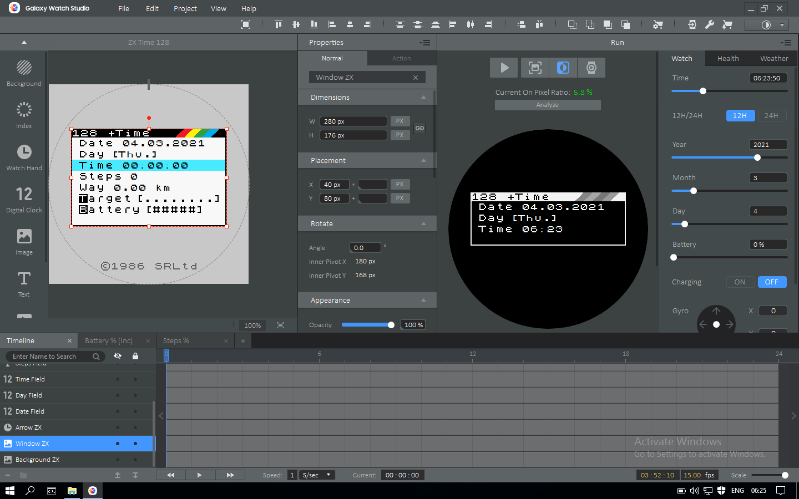

# ZX +Time 128 Watch face for Samsung Galaxy Watch
Retro watch face similar to the launch screen of the ZX Spectrum 128k operating system for Samsung smart watches with 360x360 screen. For everyone who was looking for a similar thing in Samsung store, but can't find it.

Watch face developed on Galaxy Watch Disigner 2.0.0 for watches with 360x360 screen size as Galaxy Watch S3/Active 2.

  
## How to install (windows): 
1. You must enable developer mode on you watch and turn on debug mode (Settings > Galaxy Watch Info > Debugging at buttom on the scroll) 
2. Connect you'r watch to the same network with your computer via Wi-Fi. See the ip address on the watch from the Wi-Fi menu. 
3. To install watch face (or other app) ues sdb.exe and command line 
-- 1. cd C:\sdb                               (to you sdb location) 
-- 2. sdb.exe                                 (enable sdb) 
-- 3. sdb connect 192.168.1.123               (insert you'r ip addres) 
-- 4. sdb install bin/ZX-Time-128-TW4.tpk     (or way to you *.tpk file) 
5. Done 
